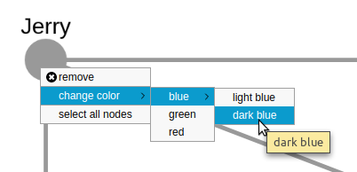

cytoscape-context-menus
================================================================================


## Description

A Cytoscape.js extension to provide context menu around elements and core instance distributed under [The MIT License](https://opensource.org/licenses/MIT).



Please cite the following paper when using this extension:

U. Dogrusoz , A. Karacelik, I. Safarli, H. Balci, L. Dervishi, and M.C. Siper, "[Efficient methods and readily customizable libraries for managing complexity of large networks](https://doi.org/10.1371/journal.pone.0197238)", PLoS ONE, 13(5): e0197238, 2018.

## Demo

Click [here](https://ivis-at-bilkent.github.io/cytoscape.js-context-menus/demo.html) (simple) or [here](https://ivis-at-bilkent.github.io/cytoscape.js-context-menus/demo-customized.html) (customized) or [here](https://ivis-at-bilkent.github.io/cytoscape.js-context-menus/demo-show-hide-menuitem.html) (with different menu items) for demos

## Dependencies

 * Cytoscape.js ^2.7.0 || ^3.0.0


## Usage instructions

Download the library:
 * via npm: `npm install cytoscape-context-menus`,
 * via bower: `bower install cytoscape-context-menus`, or
 * via direct download in the repository (probably from a tag).

Import the library as appropriate for your project:

ES import:

Note: es import doesn't work for plain javascript applications because webpack doesn't support es module output at the moment.

```js
import cytoscape from 'cytoscape';
import contextMenus from 'cytoscape-context-menus';

// register extension
cytoscape.use(contextMenus);

// import CSS as well
import 'cytoscape-context-menus/cytoscape-context-menus.css';
```

CommonJS:
```js
var cytoscape = require('cytoscape');
var contextMenus = require('cytoscape-context-menus');

contextMenus(cytoscape); // register extension
```

AMD:
```js
require(['cytoscape', 'cytoscape-context-menus'], function(cytoscape, contextMenus) {
  contextMenus(cytoscape); // register extension
});
```

Plain HTML/JS has the extension registered for you automatically, because no `require()` is needed.

## Default Options
```js
var options = {
    // Customize event to bring up the context menu
    // Possible options https://js.cytoscape.org/#events/user-input-device-events
    evtType: 'cxttap',
    // List of initial menu items
    // A menu item must have either onClickFunction or submenu or both
    menuItems: [/*
      {
        id: 'remove', // ID of menu item
        content: 'remove', // Display content of menu item
        tooltipText: 'remove', // Tooltip text for menu item
        image: {src : "remove.svg", width : 12, height : 12, x : 6, y : 4}, // menu icon
        // Filters the elements to have this menu item on cxttap
        // If the selector is not truthy no elements will have this menu item on cxttap
        selector: 'node, edge', 
        onClickFunction: function () { // The function to be executed on click
          console.log('remove element');
        },
        disabled: false, // Whether the item will be created as disabled
        show: false, // Whether the item will be shown or not
        hasTrailingDivider: true, // Whether the item will have a trailing divider
        coreAsWell: false // Whether core instance have this item on cxttap
        submenu: [] // Shows the listed menuItems as a submenu for this item. An item must have either submenu or onClickFunction or both.
      },
      {
        id: 'hide',
        content: 'hide',
        tooltipText: 'hide',
        selector: 'node, edge',
        onClickFunction: function () {
          console.log('hide element');
        },
        disabled: true
      },
      {
        id: 'add-node',
        content: 'add node',
        tooltipText: 'add node',
        image: {src : "add.svg", width : 12, height : 12, x : 6, y : 4},
        selector: 'node',
        coreAsWell: true,
        onClickFunction: function () {
          console.log('add node');
        }
      }*/
    ],
    // css classes that menu items will have
    menuItemClasses: [
      // add class names to this list
    ],
    // css classes that context menu will have
    contextMenuClasses: [
      // add class names to this list
    ],
    // Indicates that the menu item has a submenu. If not provided default one will be used
    submenuIndicator: { src: 'assets/submenu-indicator-default.svg', width: 12, height: 12 }
};
```

**Note:** `selector` and `coreAsWell` options are ignored for the items that are inside a submenu. Their visiblity depends on their root parent's visibility. 

## API

### Instance API

```js
var instance = cy.contextMenus(options);
```

#### `instance.isActive()`
* Returns whether the extension is active.

#### `instance.appendMenuItem(item, parentID = undefined)`
* Appends given menu item to the menu items list.
* If parentID is specified, the item is inserted to the submenu of the item with parentID. 
* If the parent has no submenu then it will automatically be created. 
* If not specified item will be inserted to the root of the contextmenu

#### `instance.appendMenuItems(items, parentID = undefined)`
* Same with above but takes an array of items

#### `instance.removeMenuItem(itemID)`
* Removes the menu item with given ID and its submenu along with

#### `instance.setTrailingDivider(itemID, status)`
* Sets whether the menuItem with given ID will have a following divider

#### `instance.insertBeforeMenuItem(item, existingItemID)`
* Inserts given item before the existingitem

#### `instance.moveToSubmenu(itemID, options = null)`
* Moves the item with given ID to the submenu of the parent with the given ID or to root with the specified options
* If `options` is a `string`, then it is the id of the parent
* If `options` is a `{ selector?: string, coreAsWell?: boolean }`, then old properties are overwritten by them and the menu item is moved to the root. If it doesn't have either properties item is **not moved**.
* If `options` is null or not provided, then it is just moved to the root  

#### `instance.moveBeforeOtherMenuItem(itemID, existingItemID)`
* Inserts the `item` before the `existingItem` and moves it to the submenu that contains the `existingItem`

#### `instance.disableMenuItem(itemID)`
* Disables the menu item with given ID.

#### `instance.enableMenuItem(itemID)`
* Enables the menu item with given ID.

#### `instance.showMenuItem(itemID)`
* Shows the menu item with given ID.

#### `instance.hideMenuItem(itemID)`
* Hides the menu item with given ID.

#### `instance.destroy()`
* Destroys the extension instance

### Other API

#### `cy.contextMenus('get')`
* Returns the existing instance to the extension

## Build targets

* `npm run build` : Build `./src/**` into `cytoscape-edge-editing.js` in production environment and minimize the file.
* `npm run build:dev` :  Build `./src/**` into `cytoscape-edge-editing.js` in development environment without minimizing the file.

## Publishing instructions

This project is set up to automatically be published to npm and bower.  To publish:

1. Build the extension : `npm run build`
1. Commit the build : `git commit -am "Build for release"`
1. Bump the version number and tag: `npm version major|minor|patch`
1. Push to origin: `git push && git push --tags`
1. Publish to npm: `npm publish .`
1. If publishing to bower for the first time, you'll need to run `bower register cytoscape-context-menus https://github.com/iVis-at-Bilkent/cytoscape.js-context-menus.git`

## Team

  * [Metin Can Siper](https://github.com/metincansiper), [Onur Şahin](https://github.com/onsah), [Hasan Balcı](https://github.com/hasanbalci) and [Ugur Dogrusoz](https://github.com/ugurdogrusoz) of [i-Vis at Bilkent University](http://www.cs.bilkent.edu.tr/~ivis)
